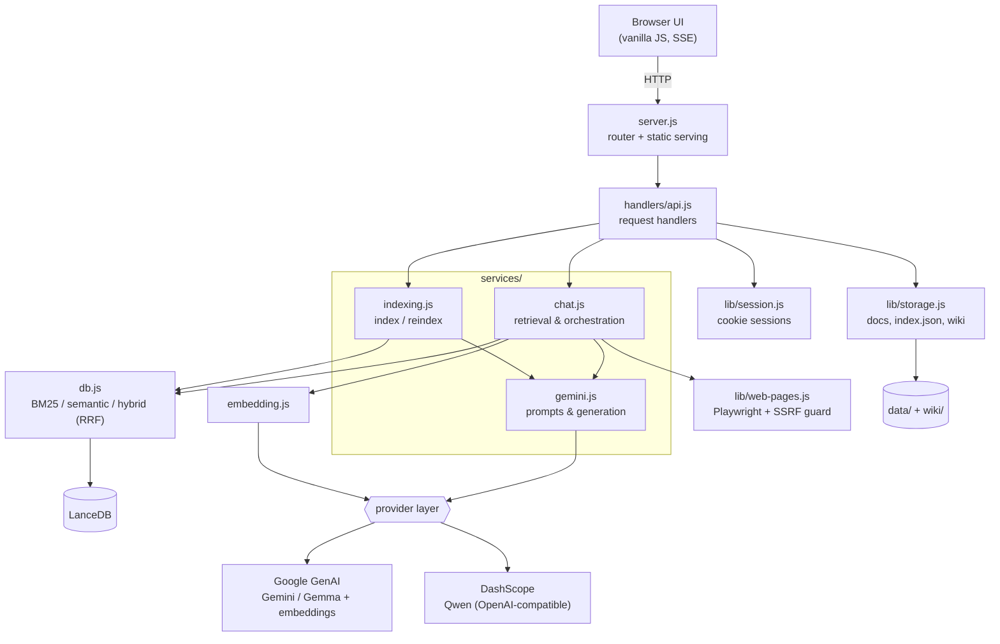
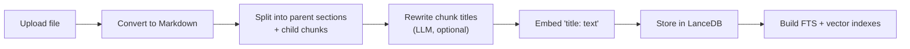
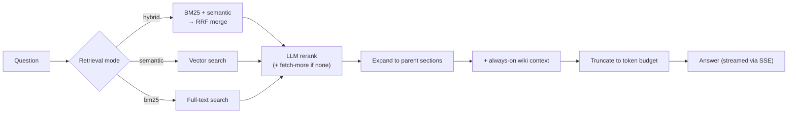
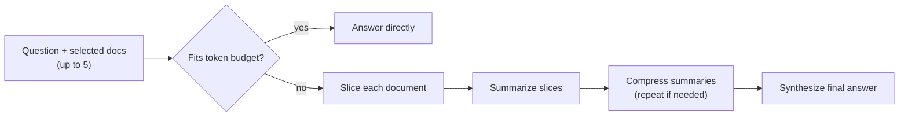

# context-hub

[](https://github.com/khoa-na/context-hub/actions/workflows/ci.yml)
[](https://nodejs.org)
[](LICENSE)

A self-hosted **document Q&A platform** built around a production-style **Retrieval-Augmented Generation (RAG)** pipeline: hybrid search, parent–child chunking, LLM reranking, and map-reduce synthesis for documents that exceed the model context window.

Upload files (or import web pages), then ask questions across everything you've added. Answers are grounded in retrieved context with citations and follow-up suggestions. It supports both **Google (Gemini / Gemma)** and **DashScope (Qwen)** models behind a single provider-agnostic layer.

> Built with **zero web framework** — plain Node.js HTTP, Server-Sent Events, and a dependency-free vanilla-JS frontend — to keep the focus on the retrieval and orchestration logic.

---

## Why this project is interesting

Most "chat with your docs" demos stop at *embed → top-k → prompt*. This one implements the techniques that actually move retrieval quality:

- **Hybrid retrieval with Reciprocal Rank Fusion (RRF)** — combines BM25 (lexical) and dense semantic search, then merges their rankings instead of relying on either alone.
- **Parent–child chunking** — search runs over small child chunks for precision, but the model answers from the larger parent section for context.
- **Contextual embeddings** — each chunk is embedded as `"<title>: <text>"` so its vector carries section context.
- **LLM-based reranking** — the chat model re-scores retrieved candidates before answering, with an automatic "fetch more" pass when nothing relevant is found.
- **Map-reduce synthesis** — documents larger than the context window are sliced, summarized, compressed, and synthesized, so full-document analysis still works at scale.
- **Provider-agnostic LLM layer** — Gemini/Gemma and Qwen behind one interface, with layered fallbacks for structured (JSON) output.
- **Hardened web scraping** — Chromium rendering with **SSRF protection** (rejects localhost/private networks, validated on every navigation) and a content-extraction heuristic that strips boilerplate.

---

## Architecture

The codebase is split by responsibility rather than piled into one server file.



| Module | Responsibility |
|---|---|
| `server.js` | HTTP bootstrap, routing, static serving, graceful shutdown |
| `handlers/api.js` | Request handlers for upload, chat, search, wiki, web pages, reindex |
| `services/chat.js` | Retrieval Q&A, full-document, and web-page orchestration |
| `services/gemini.js` | Prompt builders + chat-model generation (with structured-output fallbacks) |
| `services/indexing.js` | Document indexing and full reindex workflow |
| `db.js` | LanceDB indexing + BM25 / semantic / hybrid (RRF) retrieval |
| `embedding.js` | Gemini embedding client (batched, with backoff) |
| `lib/chunking.js` | Heading-aware chunking and document slicing |
| `lib/markdown.js` | File → Markdown conversion + encoding repair |
| `lib/web-pages.js` | URL validation (SSRF), Chromium rendering, session page storage |
| `lib/model-providers.js` | Provider/model resolution and API-key precedence |
| `lib/full-document-schemas.js` | Schema focus presets (financial / operational / risk / generic) |
| `lib/storage.js` · `lib/session.js` | Local metadata + wiki; cookie-backed sessions |

---

## How it works

### Indexing



### Retrieval Q&A



### Full-document (map-reduce)



---

## Features

- Upload `.txt`, `.md`, `.json`, `.csv`, `.tsv`, `.html`, `.xml`, `.docx`, and source-code files → converted to Markdown and indexed.
- Three retrieval modes: **hybrid**, **semantic**, **bm25**.
- **Full-document mode** for up to 5 selected documents (summary, synthesis, cross-document comparison).
- **Web-pages mode**: paste public URLs, render with Chromium, then ask about selected pages with `Auto` / `Fast` / `Full scan` read depth.
- **Wiki context**: drop `.md` / `.txt` into `wiki/default/` to always inject as context.
- **Assistance mode**: an internal work-assistant ("DS") that reads a local task list and produces a daily brief.
- Structured answers with **citations + follow-up questions**, schema-aware synthesis presets, and a model selector (Gemini / Gemma / Qwen).
- Streaming answers over **Server-Sent Events**, cookie-backed sessions, and a retrieval-only debug endpoint (`/api/search`).

---

## Tech stack

**Runtime:** Node.js (built-in `http`, `fs`, SSE) · **Vector DB:** LanceDB · **LLMs:** Google GenAI (Gemini / Gemma + embeddings), DashScope/Qwen (OpenAI-compatible) · **Scraping:** Playwright (Chromium) · **Parsing:** Busboy (multipart), Mammoth (`.docx`) · **Frontend:** vanilla HTML/CSS/JS · **Tests:** Node built-in test runner · **CI:** GitHub Actions · **Container:** Docker.

---

## Quickstart

### Local

```bash
# 1. Configure environment
cp .env.example .env        # then fill in your keys

# 2. Install and run
npm install
npm start
```

Open `http://localhost:3000`. If `HOST=0.0.0.0`, startup logs also print LAN URLs (e.g. `http://192.168.x.x:3000`).

`.env` example:

```env
GEMINI_API_KEY=your_gemini_key
DASHSCOPE_API_KEY=your_dashscope_key
GEMINI_MODEL=gemma-4-31b-it
PORT=3000
HOST=0.0.0.0
```

### Docker

The image is based on the official Playwright image, so Chromium and its system dependencies are already included.

```bash
docker build -t context-hub .

docker run --rm -p 3000:3000 \
  -e GEMINI_API_KEY=your_gemini_key \
  -e DASHSCOPE_API_KEY=your_dashscope_key \
  -v "$(pwd)/data:/app/data" \
  context-hub
```

Runtime data (uploaded docs, LanceDB, sessions) lives under `/app/data` — mount a volume there to persist it.

---

## Testing

Unit tests run with Node's built-in test runner (no extra dependencies) and cover the highest-value logic: retrieval fusion helpers, chunking, Markdown conversion, schema-preset selection, SSRF guards, structured-output parsing, and provider/API-key resolution.

```bash
npm test            # run the suite
npm run test:watch  # watch mode
npm run test:coverage
```

CI runs the suite on Node 20.x and 22.x for every push and pull request.

---

## Retrieval evaluation

A small evaluation harness measures retrieval quality instead of eyeballing answers. It indexes the four sample quarterly reports into an isolated LanceDB instance and runs a 24-question golden set through each retrieval mode, scoring **document-level** metrics.

```bash
npm run eval   # requires GEMINI_API_KEY for embeddings
```

Latest run (24 questions, corpus of 4 reports, top-k = 10):

| Mode | Recall@1 | Recall@3 | MRR | nDCG@3 |
|---|---:|---:|---:|---:|
| bm25 | 0.625 | 0.917 | 0.764 | 0.787 |
| semantic | 0.792 | 1.000 | 0.889 | 0.918 |
| **hybrid** | **0.833** | **1.000** | **0.903** | **0.928** |

Hybrid (BM25 + semantic merged with RRF) ranks the correct report first **83%** of the time vs **63%** for lexical-only BM25, and always surfaces it within the top 3. The reports share an identical structure and differ mainly in their numbers, so picking the right quarter is a genuine ranking challenge. See [`eval/`](eval/) for the dataset, metrics, and full report.

---

## API

| Endpoint | Method | Description |
|---|---|---|
| `/api/upload` | POST | Upload a file, convert to Markdown, and optionally index it |
| `/api/documents` | GET | List uploaded document metadata |
| `/api/documents/:id` | DELETE | Delete a document and remove its indexed chunks |
| `/api/chat` | POST | Retrieval Q&A or full-document / web-page / assistance answer |
| `/api/chat/stream` | POST | Streaming retrieval Q&A (Server-Sent Events) |
| `/api/search` | POST | Retrieval-only debug endpoint (no model call) |
| `/api/web-pages` | GET / POST | List or import public web pages for the session |
| `/api/web-pages/:id` | DELETE | Remove a web page from the session |
| `/api/wiki-upload` · `/api/wiki-list` | POST / GET | Manage always-on wiki Markdown |
| `/api/reindex` | POST | Re-index all documents |
| `/api/models` | GET | Configured chat-model options |
| `/api/save-key` | POST | Save provider API keys into `.env` |
| `/api/session/reset` | POST | Start a fresh local chat session |

### Example: `/api/chat`

```json
{
  "question": "Tóm tắt các rủi ro chính",
  "apiKeys": { "google": "your-gemini-key", "dashscope": "your-dashscope-key" },
  "chatMode": "full-document",
  "documentIds": ["doc-a", "doc-b"],
  "retrievalMode": "hybrid"
}
```

`/api/chat/stream` uses the same request shape and emits `start` (retrieved chunks), `token` (streamed text), `done`, and `error` events.

---

## Configuration

| Variable | Default | Description |
|---|---|---|
| `GEMINI_API_KEY` | — | Required for embeddings, indexing, and Gemini/Gemma generation |
| `DASHSCOPE_API_KEY` | — | Required for DashScope/Qwen generation |
| `DASHSCOPE_BASE_URL` | `https://dashscope-intl.aliyuncs.com/compatible-mode/v1` | OpenAI-compatible base URL override |
| `GEMINI_MODEL` | `gemma-4-31b-it` | Default Google generation model |
| `WEB_PAGE_FETCH_TIMEOUT_MS` | `30000` | Browser navigation timeout |
| `PORT` | `3000` | Server port |
| `HOST` | `0.0.0.0` | Bind address (`127.0.0.1` for local-only) |

Code-level tuning lives in `config.js` (token budgets, full-document slicing, rerank fetch counts, embedding settings, model list).

---

## Notes & limitations

- Semantic and hybrid retrieval require Gemini embeddings. If a DashScope model is selected but no Google key is available, Q&A falls back to BM25.
- Wiki files are injected directly into prompts and are not returned by `/api/search`.
- Web pages must be public `http`/`https`; localhost and private-network URLs are rejected. Rendered pages are stored per session and cleaned up on restart.
- Each session keeps up to 8 web pages and the last 24 chat history entries.
- `data/index.json` is local metadata; document content and LanceDB storage stay on each machine.
- There is no authentication layer — intended for local / trusted-network use.

---

## License

[Apache 2.0](LICENSE)
